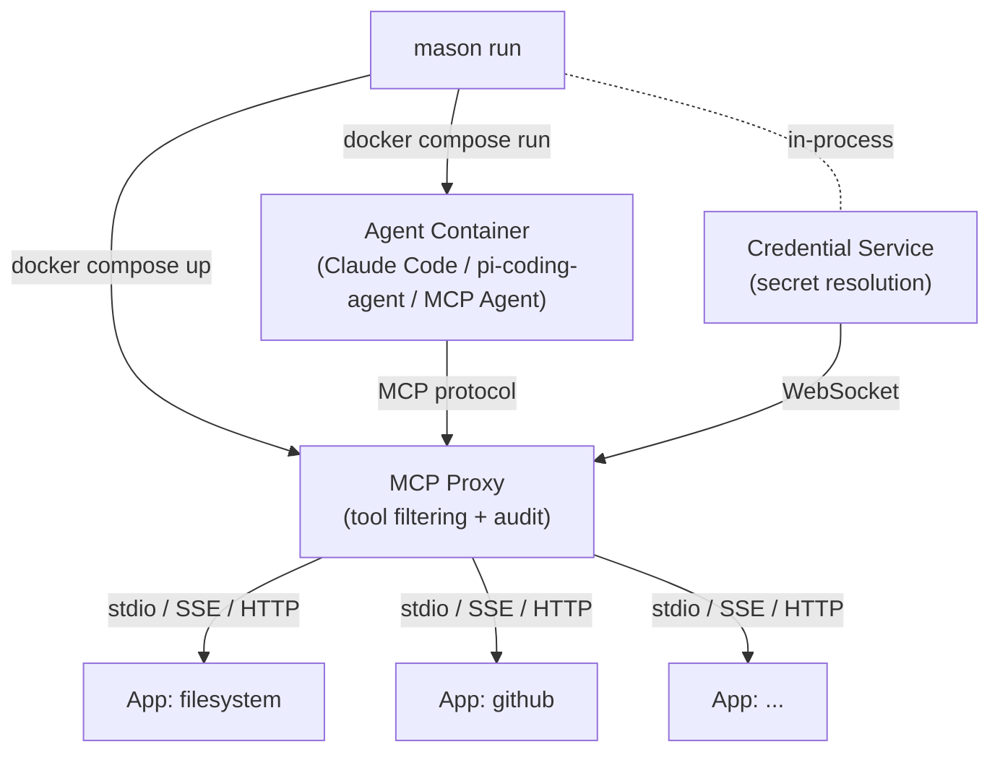
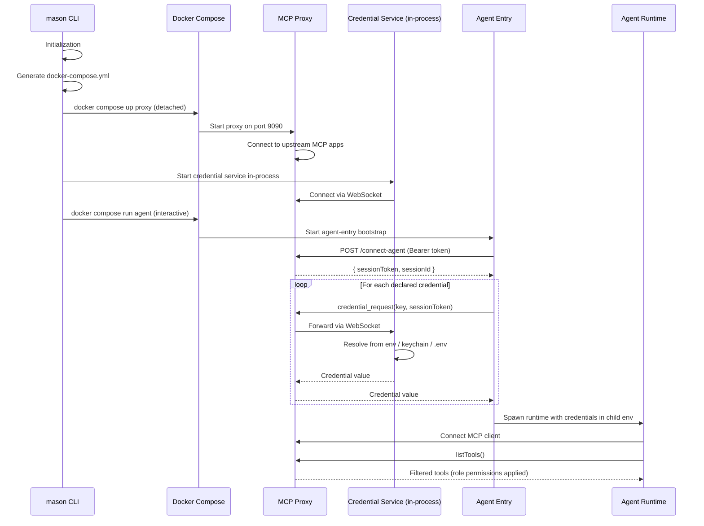
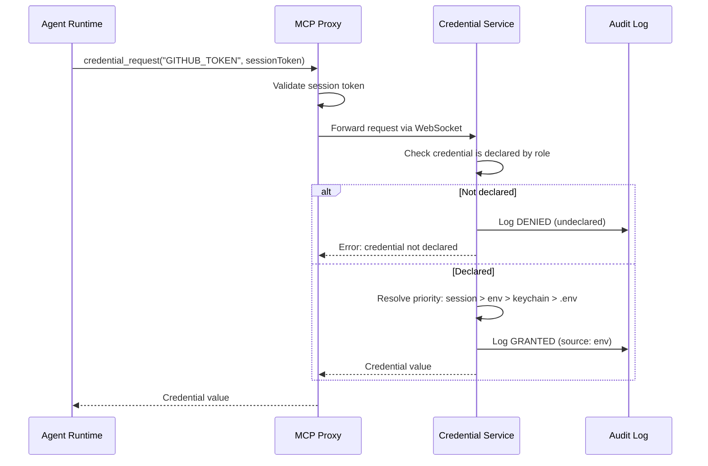
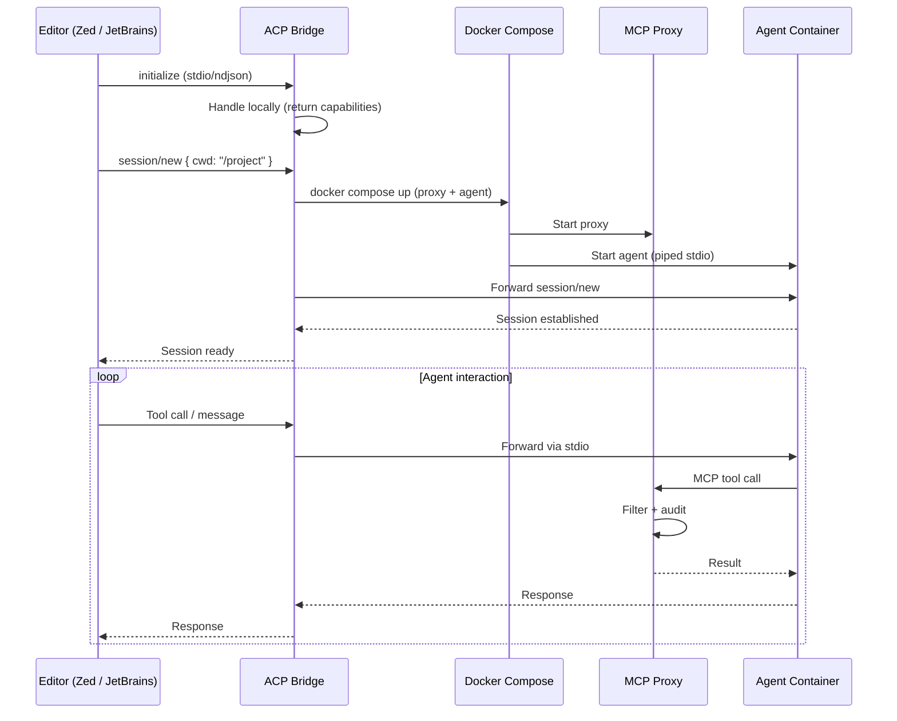

# Runtime Architecture

Mason uses a two-container model for agent execution: an **MCP Proxy** for tool filtering and a containerized **Agent** running the AI runtime. The **Credential Service** runs in-process on the host for secure secret management.

## Container Architecture

## Role Startup Sequence

When you run `mason run <agent-type> --role <name>`, the following sequence executes. See [Initialization](initialization.md) for details on how the `.mason` directory is set up before this point.

## Tool Call Flow

Every tool call passes through the proxy for filtering and audit:

## Credential Resolution Flow

Credentials are never stored in environment variables or Docker configuration:

## ACP Mode Architecture

In ACP (Agent Communication Protocol) mode (`mason run <agent-type> --role <name> --acp`), mason integrates directly with editors:

## Materializer Pattern

The same role definition is translated into runtime-specific configurations via the **Agent Package SDK**. Each agent runtime is an npm module (`@clawmasons/<agent>`) that exports an `AgentPackage` with a `RuntimeMaterializer`. The CLI discovers and loads them at runtime via the `AgentRegistry`.

| Runtime | Aliases | Generated Artifacts |
|---------|---------|-------------------|
| **claude-code-agent** | `claude` | `.claude/` directory, `AGENTS.md`, `settings.json`, slash commands, skill files, Dockerfile |
| **pi-coding-agent** | `pi` | pi-coding-agent configuration, instruction files, Dockerfile |
| **mcp-agent** | `mcp` | Minimal config for testing (no LLM required) |

The materializer reads the resolved role graph and produces everything the runtime needs, including Dockerfiles, configuration files, and mounted skill/prompt content. Custom agents can be registered in `.mason/config.json` by pointing to any npm package that implements the Agent Package SDK.

## Related

- [Initialization](initialization.md) — How lodges and runtime directories are set up
- [MCP Proxy](component-mcp-proxy.md) — Detailed proxy documentation
- [Credential Service](component-credential-service.md) — How credentials are resolved
- [Security](security.md) — The full security model
