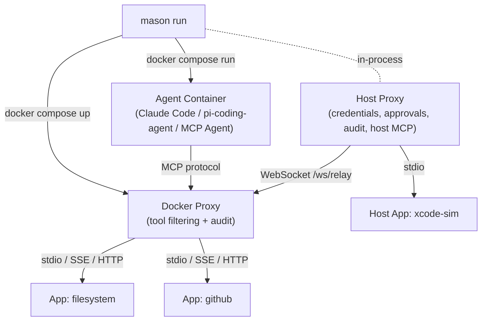
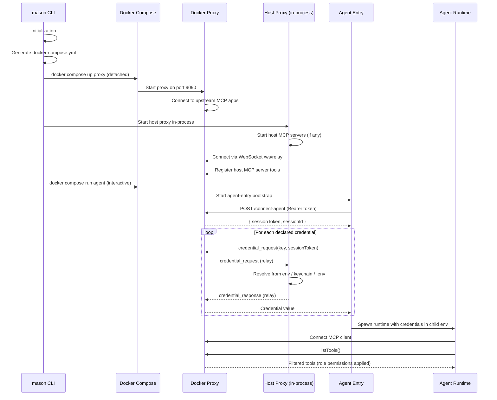
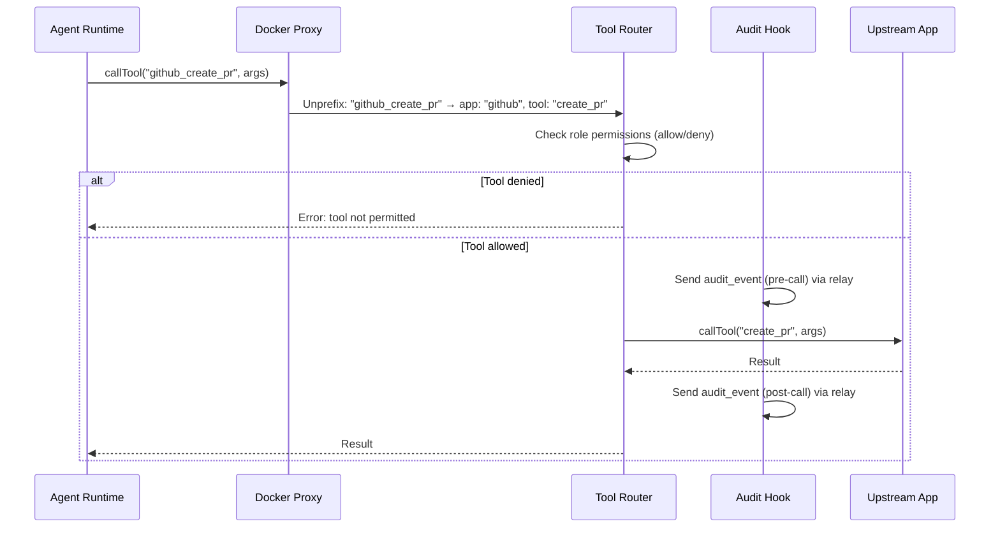
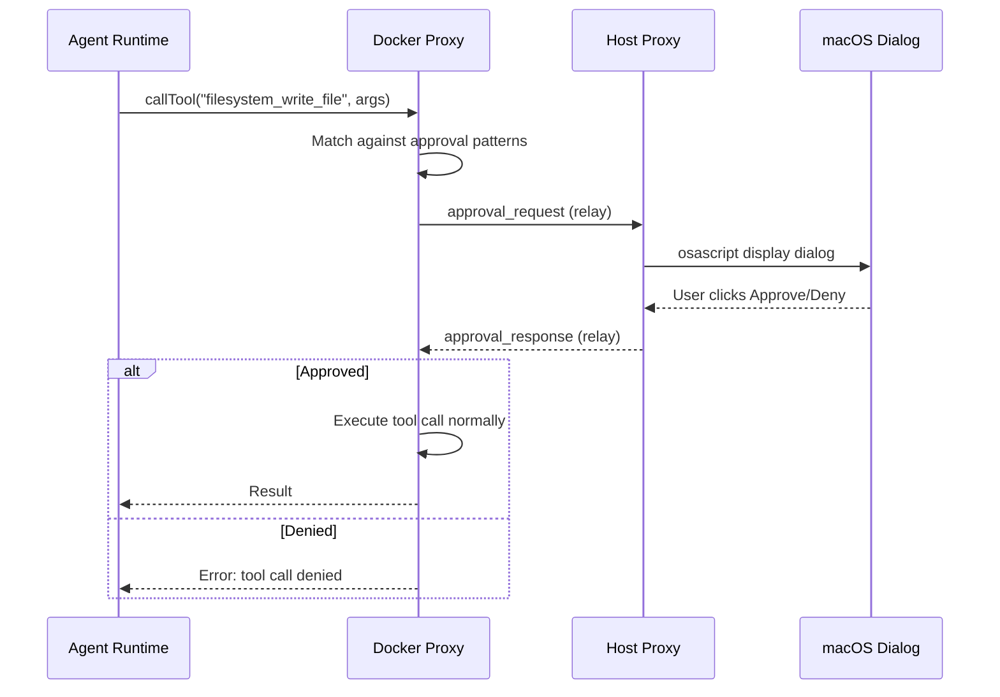
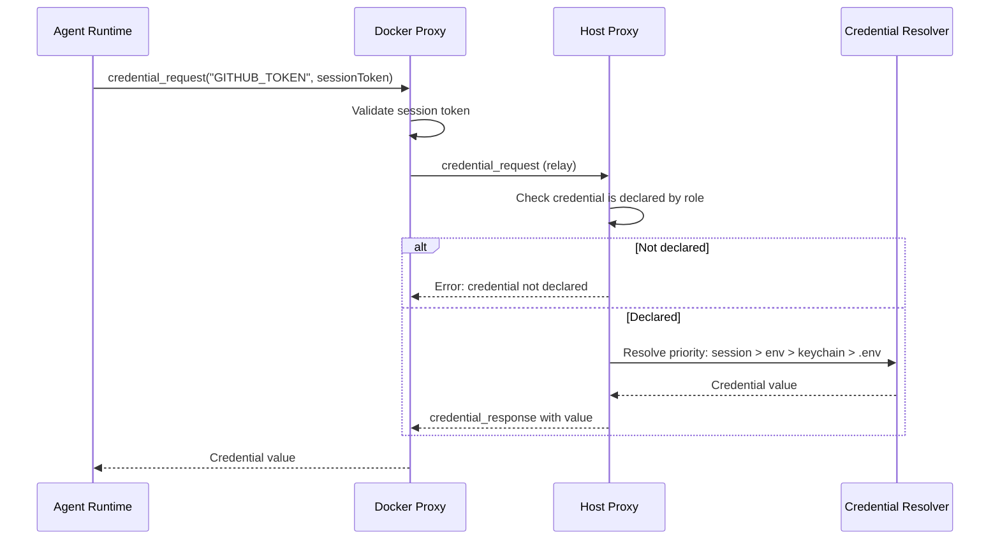
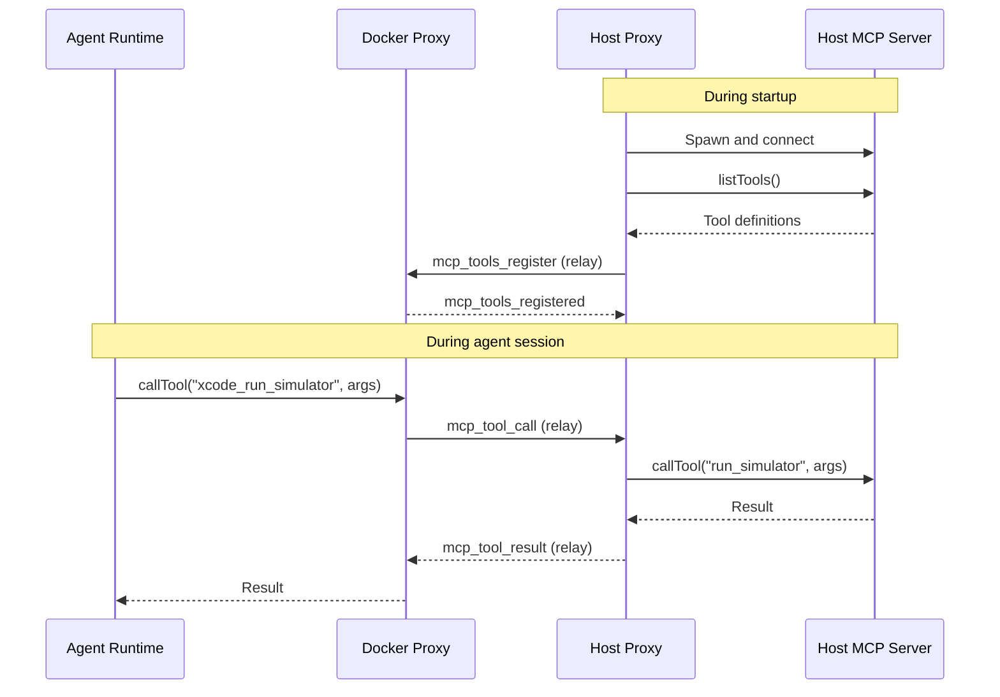

# Runtime Architecture

Mason uses a two-container model for agent execution: a **Docker-Side Proxy** for tool filtering and a containerized **Agent** running the AI runtime. A **Host Proxy** runs in-process on the host for credential resolution, approval dialogs, audit logging, and host MCP server management. The two sides communicate over a unified **relay WebSocket**.

## Container Architecture



## Role Startup Sequence

When you run `mason run <agent-type> --role <name>`, the following sequence executes. See [Initialization](initialization.md) for details on how the `.mason` directory is set up before this point.



## Tool Call Flow

Every tool call passes through the proxy for filtering and audit:



## Approval Flow

When a tool call matches a role's `requireApprovalFor` pattern:



## Credential Resolution Flow

Credentials are never stored in environment variables or Docker configuration:



## Host MCP Server Flow

MCP servers with `location: host` run on the host machine, with tool calls relayed through the proxy:



## ACP Mode Architecture

In ACP (Agent Communication Protocol) mode (`mason run <agent-type> --role <name> --acp`), mason integrates directly with editors:


## Materializer Pattern

The same role definition is translated into runtime-specific configurations via the **Agent Package SDK**. Each agent runtime is an npm module (`@clawmasons/<agent>`) that exports an `AgentPackage` with a `RuntimeMaterializer`. The CLI discovers and loads them at runtime via the `AgentRegistry`.

| Runtime | Aliases | Generated Artifacts |
|---------|---------|-------------------|
| **claude-code-agent** | `claude` | `.claude/` directory, `settings.json`, slash commands, skill files (SKILL.md + companions), Dockerfile |
| **pi-coding-agent** | `pi` | pi-coding-agent configuration, instruction files, Dockerfile |
| **mcp-agent** | `mcp` | Minimal config for testing (no LLM required) |

The materializer reads the resolved role graph and produces everything the runtime needs, including Dockerfiles, configuration files, and mounted skill/prompt content. Custom agents can be registered in `.mason/config.json` by pointing to any npm package that implements the Agent Package SDK.

### Task Read/Write Flow

Tasks are read from a source agent's project folder and written to a target agent's format. The Agent Package SDK provides generic `readTasks()` and `materializeTasks()` functions that use each agent's `AgentTaskConfig` to handle format differences automatically.

```
Source Agent Files          ResolvedTask[]           Target Agent Files
─────────────────          ──────────────           ──────────────────
.claude/commands/           readTasks()              .pi/prompts/
  ops/                    ─────────────►              ops-triage-fix-bug.md
    triage/                 name: fix-bug             ops-triage-review.md
      fix-bug.md            scope: ops:triage
      review.md             prompt: "..."           materializeTasks()
                            ...                   ◄─────────────────
```

Each `AgentPackage` declares an `AgentTaskConfig` that specifies:
- **projectFolder**: Where task files live (e.g., `.claude/commands`)
- **nameFormat**: How filenames are constructed (e.g., `{scopePath}/{taskName}.md`)
- **scopeFormat**: Whether scope uses directories (`path`) or kebab prefixes (`kebab-case-prefix`)
- **supportedFields**: Which metadata fields appear in YAML frontmatter
- **prompt**: Where the prompt content lives (currently `markdown-body`)

See [Task](task.md) for the full task model documentation.

### Skill Read/Write Flow

Skills are static file trees (SKILL.md + optional companions like templates, examples, schemas) that are copied verbatim between agent formats. The SDK provides `readSkills()` and `materializeSkills()` functions driven by each agent's `AgentSkillConfig`.

```
Source Agent Files          ResolvedSkill[]          Target Agent Files
─────────────────          ───────────────          ──────────────────
.mason/skills/              readSkills()             .claude/skills/
  labeling/               ─────────────►              labeling/
    SKILL.md                name: labeling              SKILL.md
    examples/               contentMap: {...}           examples/
      example1.md           artifacts: [...]              example1.md
                                                    materializeSkills()
                                                  ◄─────────────────
```

Each `AgentPackage` declares an `AgentSkillConfig` with:
- **projectFolder**: Where skill directories live (e.g., `.claude/skills`)

Unlike tasks, skills require no per-agent transformation — files are copied verbatim. Content is populated by `resolveSkillContent()` in the CLI orchestrator before materialization.

See [Skill](skill.md) for the full skill model documentation.

## Related

- [Initialization](initialization.md) — How lodges and runtime directories are set up
- [Proxy](proxy.md) — Detailed proxy documentation
- [Security](security.md) — The full security model
